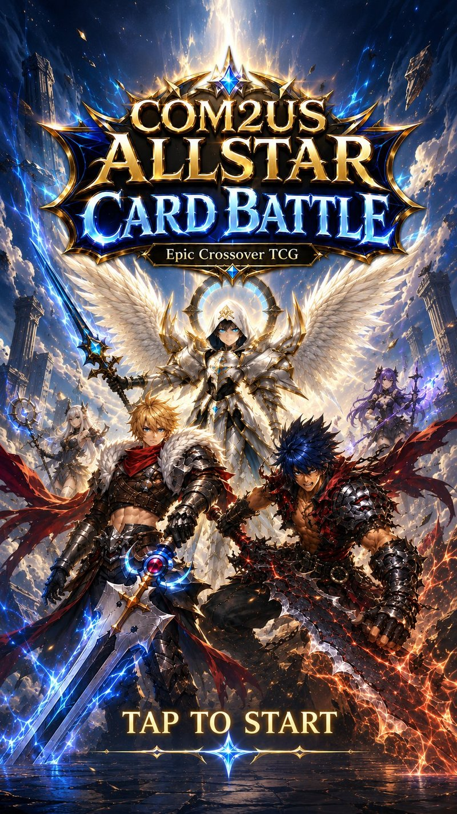

# 컴투스 올스타 카드 배틀

> 컴투스 IP 크로스오버 TCG. 가챠로 카드 모으고 가위바위보로 배틀.



---

## 🎮 게임 흐름

1. **타이틀** → 탭해서 시작
2. **메인 허브** — 무료 카드팩 가챠 (30초 쿨다운)
3. **컬렉션** — 보유 카드 확인
4. **배틀** — 가위/바위/보 + 별 등급으로 승부
5. **10연승 보상** — 무료 카드팩 1회 추가 적립

**전투 규칙**
- 가위 > 보 / 보 > 바위 / 바위 > 가위
- 같은 속성: 별 높은 쪽 승, 같으면 무승부

---

## 📁 폴더 구조

```
com2us-card-battle/
├── index.html          ← 게임 진입점 (브라우저로 여는 파일)
├── card-editor.html    ← 🎴 카드 에디터 (코드 안 만지고 카드 관리)
├── style.css           ← 모든 디자인
├── js/
│   ├── cards.js        ← 카드 데이터 (에디터가 만들어주는 파일)
│   ├── game.js         ← 게임 로직 (가챠, 배틀, 저장)
│   └── ui.js           ← 화면 그리기
├── assets/
│   ├── title.jpg       ← 타이틀 화면 배경
│   └── cards/          ← 카드 이미지 (여기에 그림 파일 넣기)
│       ├── artamiel.jpg
│       ├── regret.jpg
│       ├── warrior.jpg
│       └── jiptokki.jpg
└── README.md
```

## 🎴 카드 에디터 사용법

`card-editor.html`을 더블클릭하면 카드 관리 도구가 열려. **코드 안 만지고 GUI로 카드 추가/수정/삭제** 가능.

### 첫 사용 흐름

1. `card-editor.html` 더블클릭
2. **"📥 샘플 로드"** 버튼 → 기본 19장이 자동으로 불러와짐
3. 왼쪽에서 카드 선택 → 오른쪽에서 편집
4. 이미지 영역에 그림 파일 **드래그 앤 드롭** → 즉시 미리보기
5. 다 만들었으면 우상단 **"💾 cards.js 내보내기"** → 파일 다운로드
6. 다운로드된 `cards.js` → 게임의 `js/cards.js`로 **덮어쓰기**
7. 업로드한 이미지들 → `assets/cards/` 폴더에 같은 ID 이름으로 저장 (예: `artamiel.jpg`)

### 베리에이션 만들기 (같은 일러스트로 등급/속성 다른 카드)

1. 베리에이션 만들고 싶은 카드 선택
2. 우상단 **"📋 복제"** 클릭 → 같은 카드가 복사돼서 새로 추가됨
3. 새 카드의 ID/이름/등급/속성을 수정
4. 이미지는 그대로 유지 (같은 일러스트 재사용)
5. 저장

### 컨셉카드 (이미지 없을 때)

일러스트가 아직 없는 카드도 미리 등록 가능. 폼에서 **"컨셉카드 모드"** 토글 ON → 색상 2개 + 아이콘 + 심볼만 입력. 나중에 일러스트 완성되면 이미지만 추가하면 됨.

### 자동 저장

편집한 내용은 브라우저에 **자동 저장**돼. 창 닫고 다시 열어도 그대로. 하지만 **다른 브라우저/PC로 옮기려면 반드시 "cards.js 내보내기"로 백업**해야 함.


---

## 🚀 게임 실행하기 (3가지 방법)

### 방법 1: GitHub Pages로 공개 URL 만들기 (가장 추천)

깃헙에 올려두면 자동으로 인터넷 주소가 생겨서 친구한테 링크 보낼 수 있어.

1. 깃헙에 새 리포 만들기 (예: `com2us-card-battle`)
2. 이 폴더 전체를 푸시
3. 리포 → **Settings** → **Pages**
4. Source: `Deploy from a branch` → Branch: `main` → Folder: `/ (root)` → **Save**
5. 1~2분 기다리면 `https://너의이름.github.io/com2us-card-battle/` 주소가 활성화됨
6. 모바일/PC 어디서나 그 주소 열면 게임 플레이 가능

### 방법 2: VS Code의 Live Server (로컬 개발용)

코드 고치면서 바로바로 확인하고 싶을 때.

1. VS Code 설치
2. 확장(Extension)에서 **Live Server** 설치
3. 프로젝트 폴더 열기 → `index.html` 우클릭 → "Open with Live Server"
4. 브라우저가 자동으로 열림

### 방법 3: 그냥 더블클릭

`index.html` 더블클릭하면 브라우저로 열림.

⚠️ **단, 일부 브라우저는 로컬 파일에서 이미지를 못 불러올 수 있음.** 그럴 땐 방법 1이나 2 사용.

---

## 🎴 새 카드 추가하는 법

### 1) 카드 이미지 만들기

- **사이즈**: 600 × 900 px (세로 2:3 비율)
- **포맷**: JPG (기본) 또는 WEBP (더 가벼움)
- **용량**: 200KB 이하 권장
- **상하 80px씩은 여유** (별/속성 배지, 이름표가 그 자리에 얹힘)

### 2) 이미지 파일 저장

`assets/cards/` 폴더에 **카드 ID와 같은 이름**으로 저장.

예시:
- `assets/cards/artamiel.jpg`
- `assets/cards/baby_dragon.jpg`

### 3) `js/cards.js` 수정

`CARDS` 배열에 한 줄 추가:

```js
{
  id: 'baby_dragon',           // 영문 ID (이미지 파일명과 동일)
  name: '아기 드래곤',          // 화면에 표시될 이름
  ip: '서머너즈워',             // 출처 IP
  stars: 4,                    // 등급 (3, 4, 5)
  attr: 'rock',                // 속성 ('rock', 'scissors', 'paper')
  image: 'assets/cards/baby_dragon.jpg'
},
```

저장 후 브라우저 새로고침하면 끝! 가챠에서 뽑힐 수 있게 됨.

### 4) 이미지 없는 카드(컨셉카드)로 시작하고 싶다면

이미지 작업이 아직 안 된 카드도 미리 등록 가능. `image`를 빼고 `theme`을 채우면 됨.

```js
{
  id: 'baby_dragon',
  name: '아기 드래곤',
  ip: '서머너즈워',
  stars: 4,
  attr: 'rock',
  theme: {
    c1: '#ff6a00',    // 배경 그라디언트 시작 색
    c2: '#5e1a00',    // 배경 그라디언트 끝 색
    icon: '🐲',       // 큰 이모지
    symbol: '✦'       // 배경에 흐릿하게 깔리는 심볼
  }
},
```

나중에 일러스트가 완성되면 `image: 'assets/cards/baby_dragon.jpg'`만 추가하면 자동으로 사진 카드로 전환됨.

---

## ⚙️ 게임 설정 바꾸는 법

### 가챠 확률 조정

`js/cards.js` 하단에서:

```js
const RARITY_PROB = { 5: 5, 4: 25, 3: 70 };  // 합이 100이어야 함
```

### 쿨다운 시간 바꾸기

```js
const COOLDOWN_MS = 30 * 1000;  // 30초 (밀리초 단위)
// 12시간으로 바꾸려면: 12 * 60 * 60 * 1000
```

### 10연승 보상 횟수 바꾸기

`js/game.js`에서 `applyBattleResult` 함수의 `state.streak >= 10` 부분 숫자 수정.

---

## 💾 진행도 저장

게임 진행도(보유 카드, 연승, 누적 가챠 수 등)는 **브라우저의 localStorage**에 자동 저장돼. 같은 브라우저로 다시 열면 이어서 플레이 가능.

> ⚠️ 시크릿 모드/다른 브라우저/다른 기기에서는 새 게임 시작됨

진행도 초기화하려면 브라우저 콘솔(F12)에서:
```js
resetGameState()
```

---

## 🤝 GPT/Claude한테 도움 받을 때 팁

"카드 추가하고 싶어" → `js/cards.js` 파일 내용 보여주고 부탁
"배틀 규칙 바꾸고 싶어" → `js/game.js`의 `judge` 함수 보여주고 부탁
"가챠 디자인 바꾸고 싶어" → `style.css`의 `.gacha-pack` 부분 보여주고 부탁

각 파일이 한 가지 역할만 해서 부분만 보내도 작업 가능.

---

## 📝 라이선스 / 사용처

- 이 게임은 컴투스의 IP를 학습/프로토타입 목적으로 사용한 fan-made 프로젝트입니다.
- 상업적 배포 시 컴투스의 공식 라이선스가 필요합니다.
- 코드는 자유롭게 수정/사용 가능합니다.
